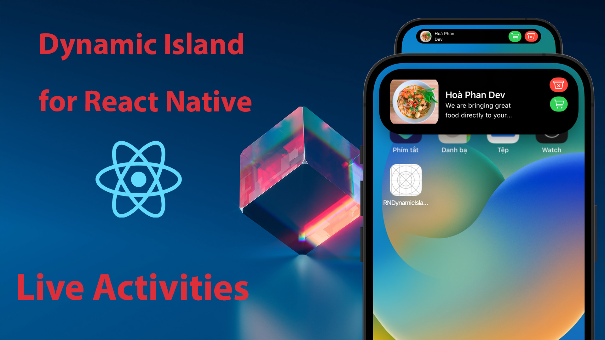

## React Native Dynamic Island Tutorial
How to implement Dynamic Island for React native. 
React Native Dynamic Island tutorial. 

### Documentation
- Require Xcode 14.1 or high. Working on iOS 16.1 or high. 
- Step 1: Build Native Modules. 
- Step 2: Build Live Activities for Dynamic Island and lock screen. 
- Step 3: Handle action event when click button. 

### Version
- Tag [v0.0.1](https://github.com/hoaphantn7604/react-native-dynamic-island-tutorial/tree/v0.0.1): Create Native Modules for React Native. 
- Tag [v0.0.2](https://github.com/hoaphantn7604/react-native-dynamic-island-tutorial/tree/v0.0.2): Build Live Activities Simple. 
- Tag [v0.0.3](https://github.com/hoaphantn7604/react-native-dynamic-island-tutorial/tree/v0.0.3): Add Deeplink. 
- Tag [v0.0.4](https://github.com/hoaphantn7604/react-native-dynamic-island-tutorial/tree/v0.0.4): Order Live Activities. 

## Video tutorial:
#### [Build Dynamic Island For React Native - Tutorial Step-by-Step](https://www.youtube.com/playlist?list=PLpMCFmfT7cNeAJaCEJbKktudFyuxufr2c)

## Donate ✨
Support maintainers with a donation and help them continue with activities.

 

   

