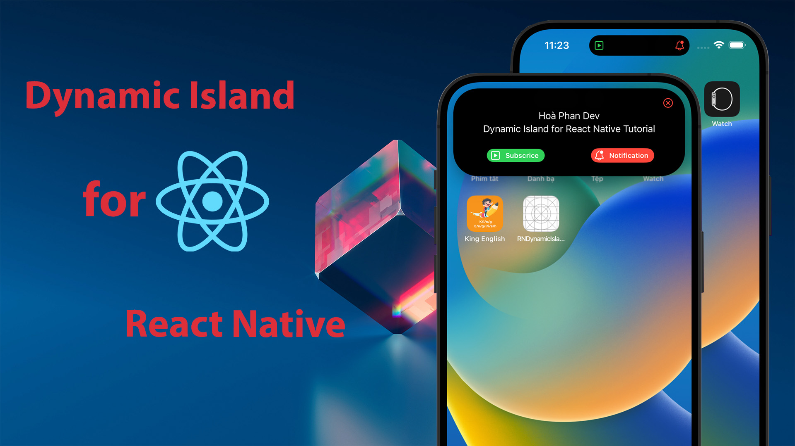

## React Native Dynamic Island Tutorial
How to implement Dynamic Island for React native. 
React Native Dynamic Island tutorial. 

### Documentation
- Require Xcode 14.1 or high. Working on iOS 16.1 or high. 
- Step 1: Build native modules. 
- Step 2: Build Live Activities for Dynamic Island and lock screen. 
- Step 3: Handle action event when click button. 

### Version
- Tag [v0.0.1](https://github.com/hoaphantn7604/react-native-dynamic-island-tutorial/tree/v0.0.1): Create native modules for react native. 
- Tag [v0.0.2](https://github.com/hoaphantn7604/react-native-dynamic-island-tutorial/tree/v0.0.2): Build Live Activity Simple. 
- Tag [v0.0.3](https://github.com/hoaphantn7604/react-native-dynamic-island-tutorial/tree/v0.0.3): Add Deeplink. 

## Video tutorial:
#### [How to implement Dynamic Island for React native #part1](https://youtu.be/WelhUZhWSGg)
#### [How to implement Dynamic Island for React native #part2](https://youtu.be/cdxp_qOb54Y)

 

   

